# Project Management Application

<div align="center">

[](https://www.php.net/)
[](https://www.mysql.com/)
[](https://developer.mozilla.org/en-US/docs/Web/JavaScript)
[](https://getbootstrap.com/)
[](https://fontawesome.com/)
[](https://jquery.com/)
[](https://api.jquery.com/jquery.ajax/)
[](https://sortablejs.github.io/Sortable/)
[](https://developer.mozilla.org/en-US/docs/Web/HTML)
[](https://developer.mozilla.org/en-US/docs/Web/CSS)
[](https://codeseven.github.io/toastr/)
[](https://jsdoc.app/)
[](https://phpdoc.org/)

</div>

## Project Description

This repository contains a student-developed project management software, created as part of the Brainster curriculum under the mentorship of Filip Manev. The application serves as a simplified task and project management system with a hierarchical user structure, including roles such as Admin, Senior (Team Lead or regular), Mid, and Junior. It demonstrates hands-on experience with role-based access control (RBAC), CRUD operations, database interactions, and core web development skills using PHP, SQL, and JavaScript.

The system is divided into a regular application for users and an Admin panel for system control. Projects are assigned to Senior Team Leads, who manage teams and tasks. Tasks (tickets) include statuses, assignments, and comments with full CRUD capabilities.

## Key Features

- **User Authentication**: Registration (with Admin approval), login (name/email), password change, and logout. Passwords are hashed for security.
- **Admin Panel**: Manage users (create, edit, approve, delete, reset passwords) and projects (create, update, assign to Team Leads, delete).
- **Project Management**: Create projects with details (title, description, requirements, estimated time, deadline); assign to Team Leads; add/remove team members (by Leads).
- **Task Management**: Create, assign, update status (To Do, In Progress, QA, Done), edit, delete tasks; Kanban view with drag-and-drop; auto-comments on status changes.
- **Comments**: Add, edit (marked as edited), delete comments on tasks; role-based restrictions.
- **RBAC**: Permissions enforced per role (e.g., Seniors manage tasks in assigned projects; Mids/Juniors limited).
- **UI Enhancements**: Bootstrap for responsive design; AJAX for forms/modals; toasts(toastr) and loaders(ajax) for feedback.

## Technology Stack

- **Backend**: PHP (OOP) for server logic, controllers, and models.
- **Database**: MySQL for data storage (users, projects, tasks, comments).
- **Frontend**: HTML/CSS with Bootstrap and Font Awesome for styling and icons; JavaScript/jQuery/toastr for interactivity (AJAX, drag-drop via Sortable.js, toastr for notifications).
- **Security**: Prepared statements for SQL; password hashing; session-based auth.

## Technologies Used

- **PHP** - Backend scripting and server-side logic
- **MySQL** - Relational database for data storage
- **JavaScript** - Client-side interactivity and dynamic features
- **Bootstrap** - Responsive front-end framework for fast UI development
- **Font Awesome** - Icon library for scalable vector icons and UI elements
- **jQuery** - Simplified DOM manipulation and AJAX handling
- **SortableJS** - Drag-and-drop sorting for tasks and UI elements
- **HTML5** - Semantic structure and modern web standards
- **CSS3** - Styling, animations, and responsive design
- **Toastr** - Elegant, non-blocking toast notifications
- **JSDoc** - Inline documentation generation for JavaScript code
- **PHPDoc** - Inline documentation generation for PHP code

## Installation and Setup

### Prerequisites

- PHP 7.4+ with PDO extension.
- MySQL database server.
- Web server (e.g., Apache, or PHP built-in).

### Steps

1. **Clone the Repository**:

   ```bash
   git clone https://git.brainster.co/Dejan.Nikolovski-FS21/Brainster-Project-2-PMA.git
   cd <name of the folder>

   ```

2. Database Configuration:

- Edit backend/includes/classes/Config.php with your MySQL credentials (DB_HOST, DB_NAME, etc.).

### First-Time Setup: Database Not Initialized

If the database does not exist or tables are missing (common on fresh setup):

1. Open XAMMP, start MySQL and Apache.
2. Open the application in your browser (e.g., `http://localhost:8000`).
3. A modal will automatically appear with the message:  
   _"The database is missing. Please initialize it below. This will create the database and seed sample data (DEV only)."_
4. Click the **Setup** (or **Initialize Database**) button in the modal.
5. Wait for the loading spinner ("Setting up...").
6. On success: A green toast notification will show "Database initialized successfully!", and the page will automatically reload after 1.5 seconds.
7. After reload: The app is fully ready. Log in with the default Admin credentials (listed below) or other seeded users.

> **Alternative 1 (CLI method)**: If preferred, run `php database/create_db.php` from the terminal in the project root - this bypasses the modal and directly initializes the DB.

#### Optional - 2.a (if the above methods doesn't work)

- Run db_sql/create_db_full_with_drop.php in a browser or via PHP CLI to create the database, tables, and seed sample data.
- (this will drop/delete any exisiting db with the same name and create a new one with all the tables and seed sample data)

#### Optional - 2.b Import database

- Open **phpMyAdmin**
- Create a new database (e.g., `nikolovski_project_management`)
- Import `db_sql/create_db.sql`
- Or Import via terminal (prerequisites: Database CLI Tools or SQL Server, SQLTools extension):

```bash
mysql -u root < db_sql/create_db.sql

```

3. Run the Application:

- Open XAMMP, start MySQL and Apache.
- Start PHP server: php -S localhost:8000.
- Access http://localhost:8000 in your browser.

4. Default Credentials:

```
- Admin User: admin@example.com / admin123
- Team Lead Senior 1: lead1@example.com / lead123
- Team Lead Senior 2: lead2@example.com / lead456
- Regular Senior 1: senior1@example.com / senior123
- Regular Senior 2: senior2@example.com / senior456
- Mid Developer 1: mid1@example.com / mid123
- Junior Developer 1: junior1@example.com / junior123
```

- Register new users for testing (approve via Admin panel).
- Create new users via admin panel.

## Usage

- Admin: Access Admin Panel to manage users/projects.
- Team Lead: View assigned projects; add/remove members; create/assign tasks.
- Senior/Mid/Junior: Interact with tasks/comments per role permissions.
- Test RBAC by logging in as different roles.

## User Uniqueness Design

The application uses **email** as the unique identifier for authentication and user lookup.  
Uniqueness of email is enforced to ensure reliable login, authorization, and password recovery.

The **name** field is intentionally **not unique** and is used only as a display attribute.  
This reflects real-world systems where user identity is managed via unique credentials (email / user ID), not human-readable names.

### Database Diagrams

<details>
<summary>Click to expand database diagrams (ER Diagram & phpMyAdmin Designer view)</summary>

#### ER Diagram

The following diagram illustrates the entity relationships between users, projects, tasks, and comments.

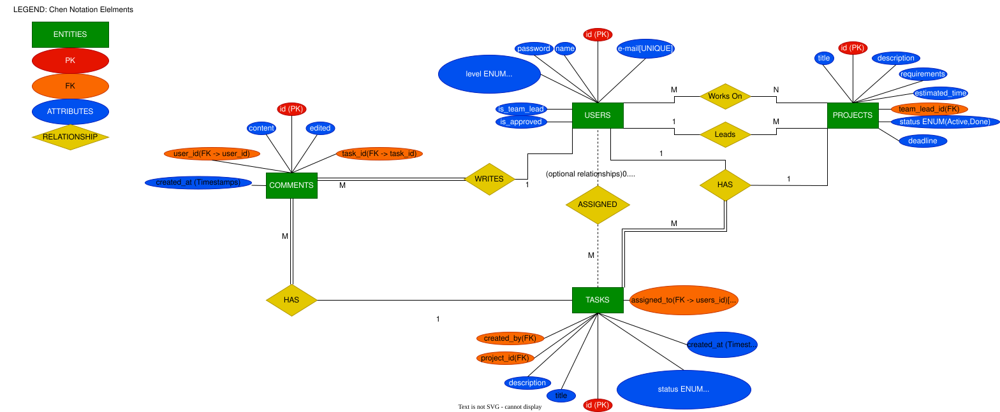

#### Designer view (phpMyAdmin)

Visual representation of the database tables and relationships in phpMyAdmin's Designer tool.

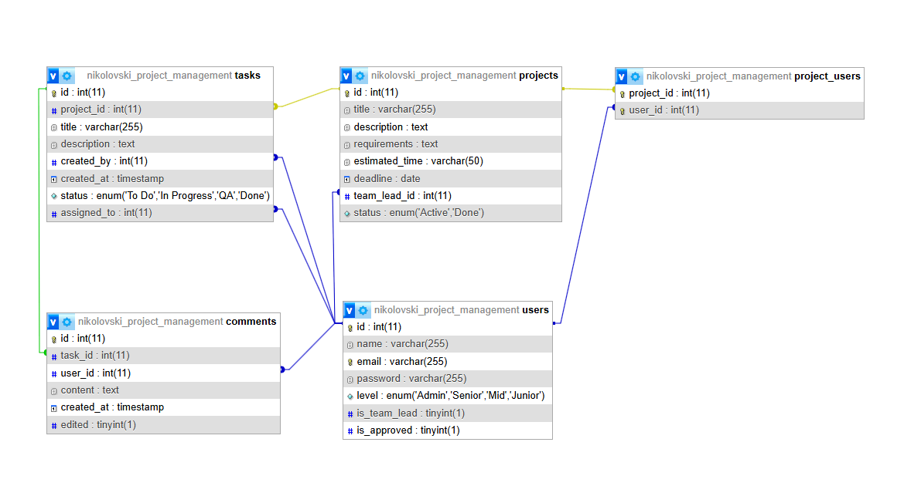

</details>

### Development Notes

- Branching: Developed on dev branch with feature branches merged in.
- Testing: Multi-role testing for permissions; AJAX flows for UX.
- Specification Reference: Full implementation of provided spec (e.g., roles from pages 2-4, permissions hierarchy from page 7).

### Project Structure

<details>
<summary>Click to expand project structure (clean MVC-like organization)</summary>

<pre>
/
├── backend
│   ├── api
│   │   └── system_health.php
│   ├── controllers
│   │   ├── admin_projects_controller.php
│   │   ├── admin_users_controller.php
│   │   ├── auth_controller.php
│   │   ├── dashboard_controller.php
│   │   ├── project_controller.php
│   │   ├── project_view_controller.php
│   │   ├── task_controller.php
│   │   └── user_controller.php
│   ├── includes
│   │   ├── classes
│   │   │   ├── Config.php
│   │   │   ├── DatabaseHelper.php
│   │   │   ├── Exceptions.php
│   │   │   ├── ProjectHelper.php
│   │   │   ├── Router.php
│   │   │   └── Validator.php
│   │   ├── api.php
│   │   ├── helpers.php
│   │   └── session_guard.php
│   ├── models
│   │   ├── Comment.php
│   │   ├── Database.php
│   │   ├── Project.php
│   │   ├── Task.php
│   │   └── User.php
│   └── views
│       ├── bootstrap
│       │   └── task_view_context.php
│       ├── partials
│       │   ├── confirm_modal.php
│       │   ├── footer.php
│       │   ├── header.php
│       │   ├── system_db_modal.php
│       │   └── task_modal_content.php
│       ├── admin_panel.php
│       ├── admin_projects.php
│       ├── admin_users.php
│       ├── change_password.php
│       ├── dashboard.php
│       ├── login.php
│       ├── project_view.php
│       ├── register.php
│       └── task_view.php
├── database
│   ├── classes
│   │   ├── DatabaseInitializer.php
│   │   ├── DatabaseSchema.php
│   │   └── DatabaseSeeder.php
│   └── create_db.php
├── db_sql
│   ├── create_db_full_with_drop.php
│   ├── create_db.sql
│   └── nikolovski_project_management.sql
├── docs
│   ├── designer_view_tables.png
│   ├── er-diagram.drawio
│   ├── er-diagram.png
│   ├── er-diagram.svg
│   ├── nikolovski_project_management.svg
│   └── Specification.pdf
├── frontend
│   ├── css
│   │   ├── custom.css
│   │   └── kanban.css
│   ├── js
│   │   ├── admin_users.js
│   │   ├── api.js
│   │   ├── auth.js
│   │   ├── comment.js
│   │   ├── confirmDelete.js
│   │   ├── kanban.js
│   │   ├── main.js
│   │   ├── modules.js
│   │   ├── pageUtils.js
│   │   ├── systemHealth.js
│   │   ├── taskModal.js
│   │   ├── ui.js
│   │   ├── utils.js
│   │   └── validation.js
│   └── vendor
│       ├── css
│       │   ├── bootstrap.min.css
│       │   ├── bootstrap.min.css.map
│       │   └── toastr.min.css
│       ├── fontawesome
│       │   ├── css
│       │   │   ├── all.css
│       │   │   └── all.min.css
│       │   └── webfonts
│       │       └── fa-solid-900.woff2
│       └── js
│           ├── bootstrap.bundle.min.js
│           ├── bootstrap.bundle.min.js.map
│           ├── bootstrap.min.js.map
│           ├── jquery.min.js
│           ├── Sortable.min.js
│           ├── toastr.js.map
│           └── toastr.min.js
├── screenshot
│   ├── admin_panel.png
│   ├── admin_projects_delete_modal.png
│   ├── admin_projects_edit_modal.png
│   ├── admin_projects.png
│   ├── admin_users_1.png
│   ├── admin_users_delete_user_modal.png
│   ├── admin_users_edit_modal.png
│   ├── admin_users_reset_password_modal.png
│   ├── admin_users.png
│   ├── change_password.png
│   ├── dashboard.png
│   ├── initial_setup.png
│   ├── login.png
│   ├── project_view_task_modal_edit_comment.png
│   ├── project_view_task_modal_edit_task.png
│   ├── project_view_task_modal.png
│   ├── project_view1.png
│   ├── project_view2.png
│   ├── project_view3.png
│   └── register.png
├── tests
│   ├── global_test.php
│   ├── permission_test.php
│   └── test_db.php
├── .gitignore
├── autoload.php
├── index.php
└── README.md
</pre>

</details>

## Live Test Deployment

A temporary test deployment of the application is available for demonstration purposes:

🔗 **URL:** https://pma.free.nf

> ⚠️ **Note:**  
> This deployment is intended **for testing and preview only**.  
> Data may be reset at any time, performance may vary, and the environment is not production-hardened.

You can use the default credentials listed to explore role-based access, project management flows, and task handling across different user roles.

## Screenshots

<details>
<summary>Click to expand screenshots (20 images showcasing the application)</summary>

<table width="100%">
  <tr>
    <td align="center" valign="top">
      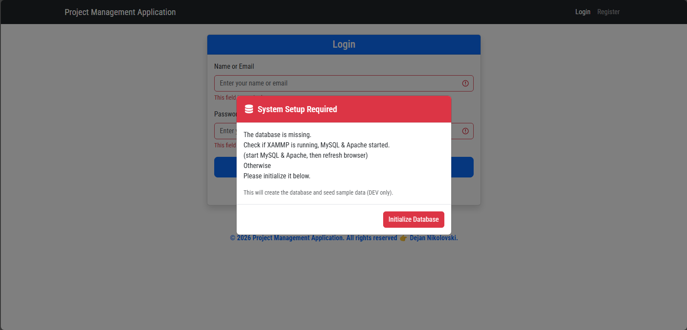
      <br><em>Initial database setup modal</em>
    </td>
    <td align="center" valign="top">
      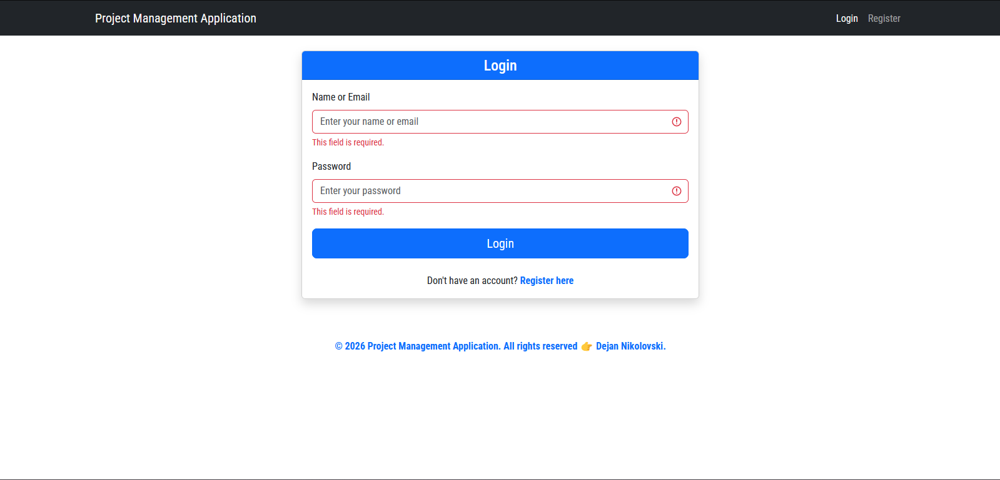
      <br><em>Login page</em>
    </td>
    <td align="center" valign="top">
      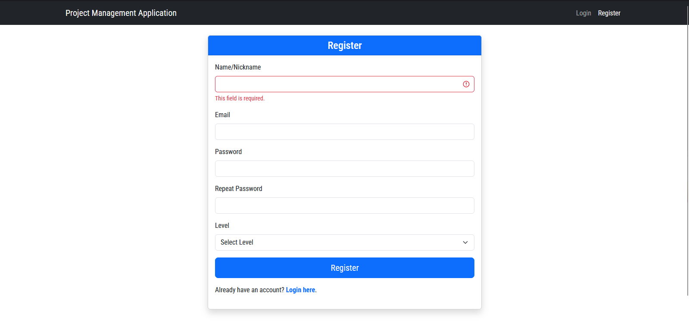
      <br><em>Registration page</em>
    </td>
    <td align="center" valign="top">
      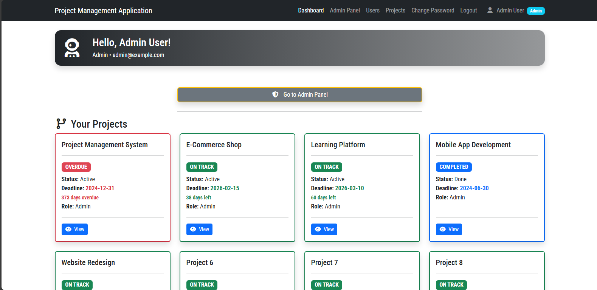
      <br><em>User dashboard</em>
    </td>
  </tr>
  <tr>
    <td align="center" valign="top">
      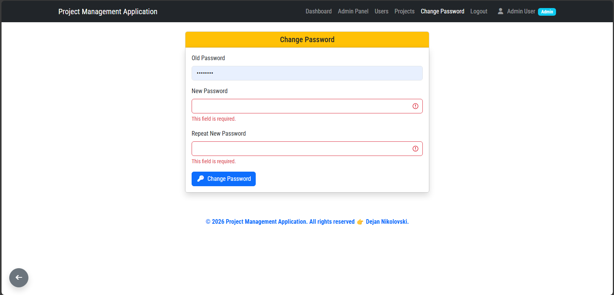
      <br><em>Change password page</em>
    </td>
    <td align="center" valign="top">
      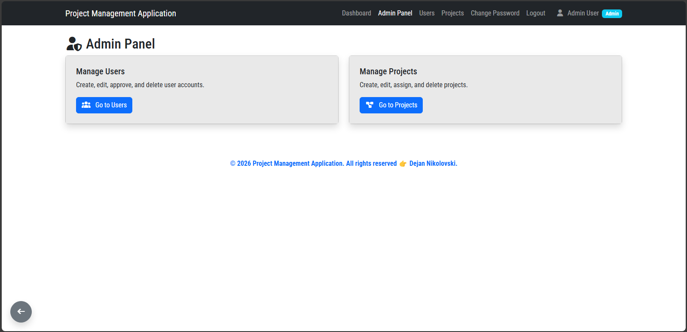
      <br><em>Admin panel overview</em>
    </td>
    <td align="center" valign="top">
      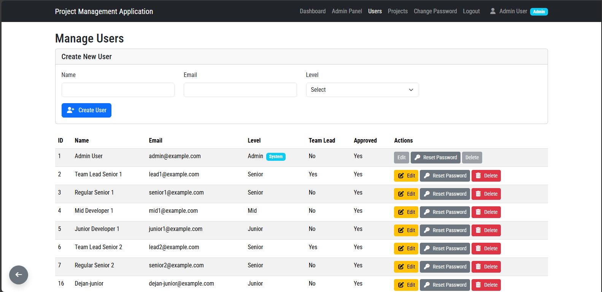
      <br><em>Admin users management</em>
    </td>
    <td align="center" valign="top">
      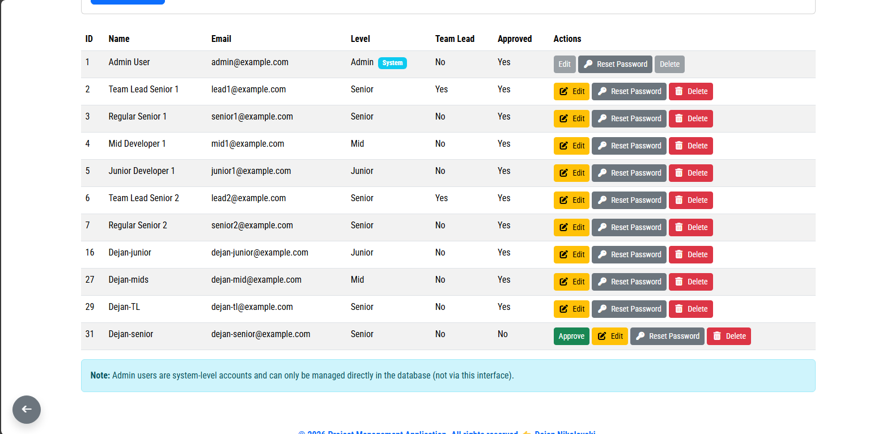
      <br><em>Admin users detailed view</em>
    </td>
  </tr>
  <tr>
    <td align="center" valign="top">
      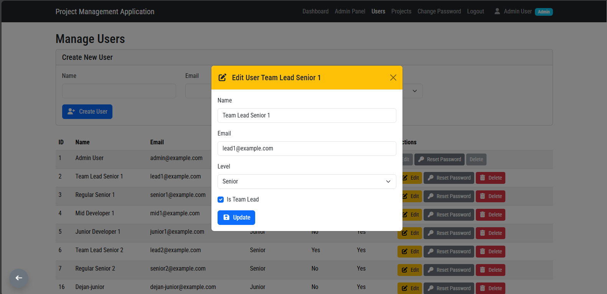
      <br><em>Edit user modal</em>
    </td>
    <td align="center" valign="top">
      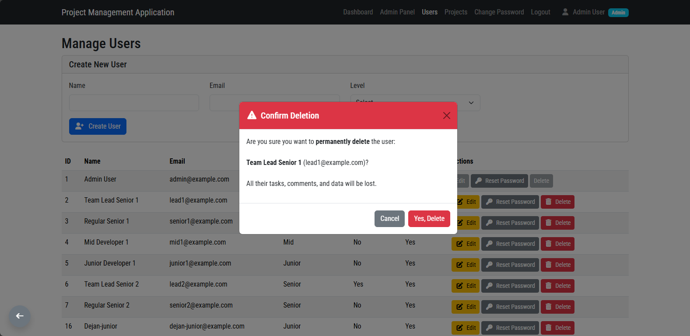
      <br><em>Delete user confirmation</em>
    </td>
    <td align="center" valign="top">
      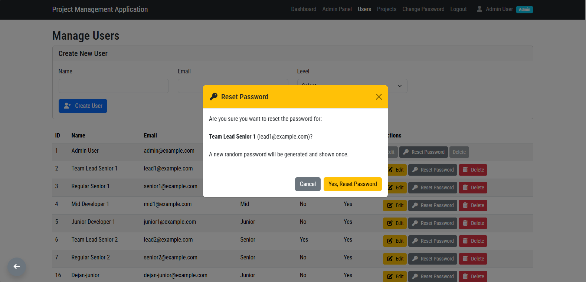
      <br><em>Reset password modal</em>
    </td>
    <td align="center" valign="top">
      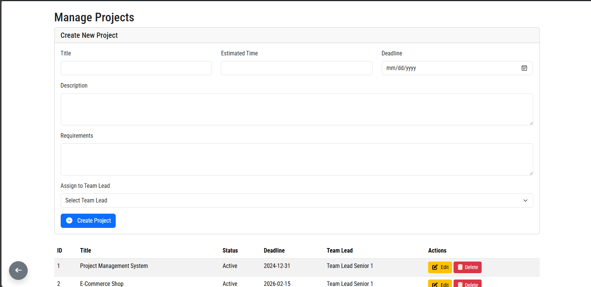
      <br><em>Admin projects management</em>
    </td>
  </tr>
  <tr>
    <td align="center" valign="top">
      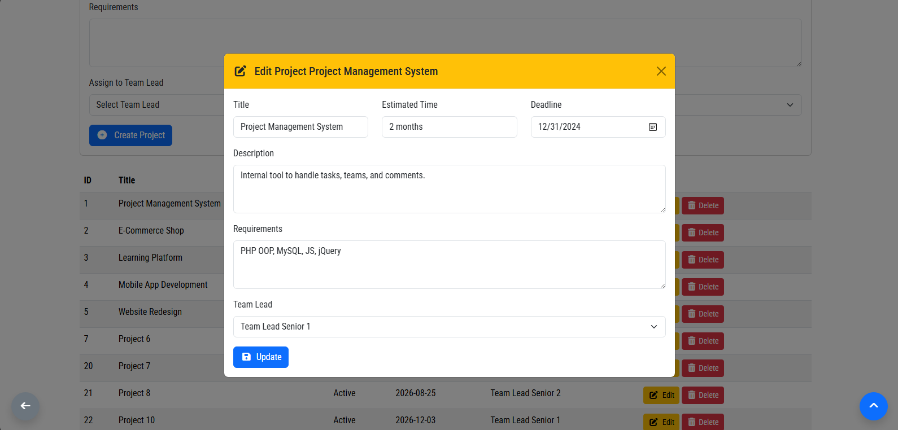
      <br><em>Edit project modal</em>
    </td>
    <td align="center" valign="top">
      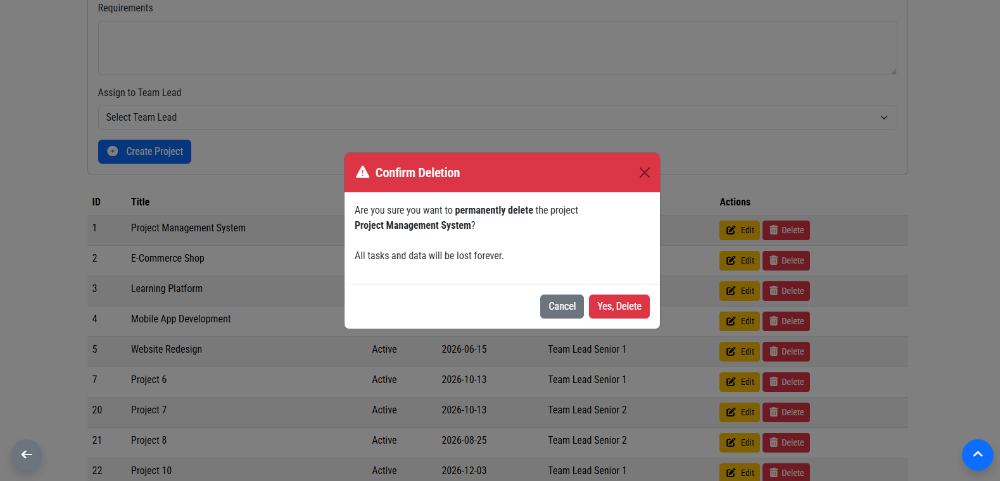
      <br><em>Delete project confirmation</em>
    </td>
    <td align="center" valign="top">
      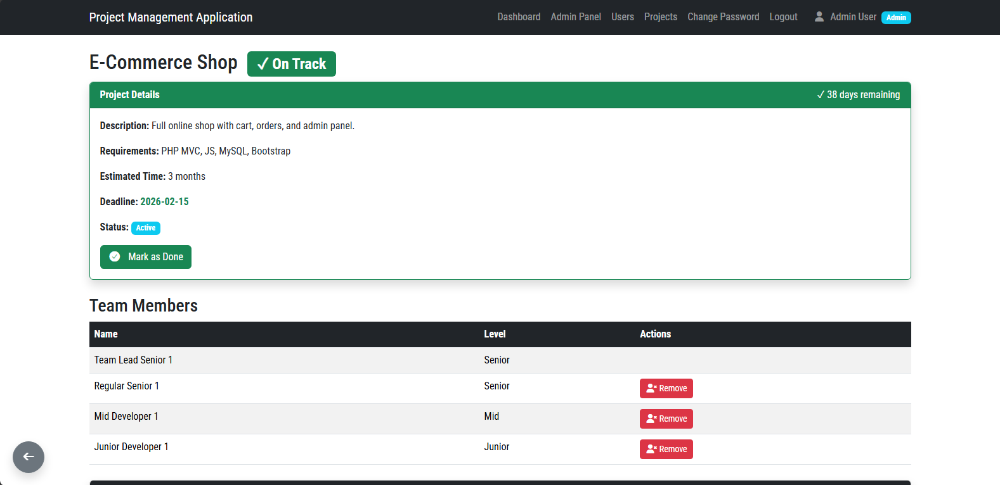
      <br><em>Project view - overview</em>
    </td>
    <td align="center" valign="top">
      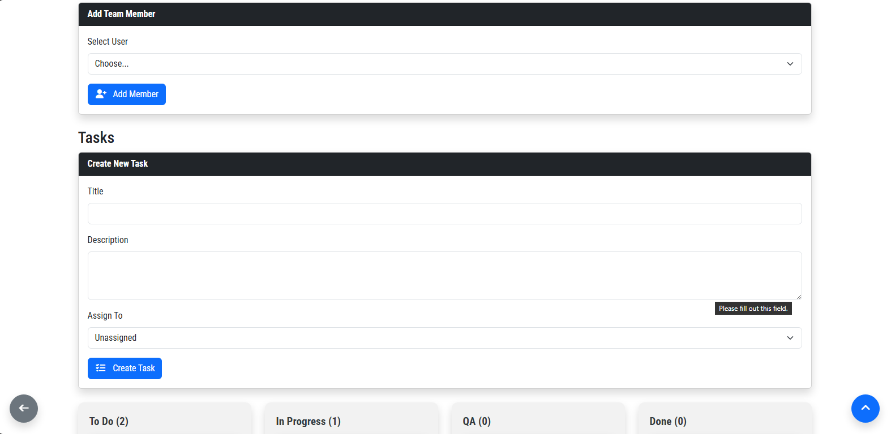
      <br><em>Project view - team members</em>
    </td>
  </tr>
  <tr>
    <td align="center" valign="top">
      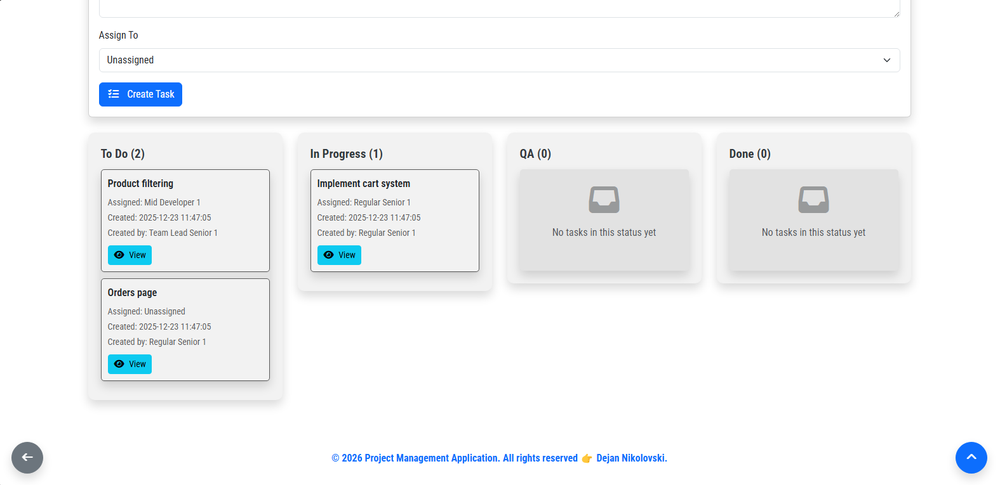
      <br><em>Project view - Kanban board</em>
    </td>
    <td align="center" valign="top">
      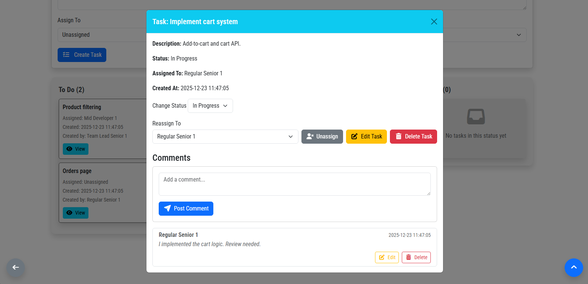
      <br><em>Task modal</em>
    </td>
    <td align="center" valign="top">
      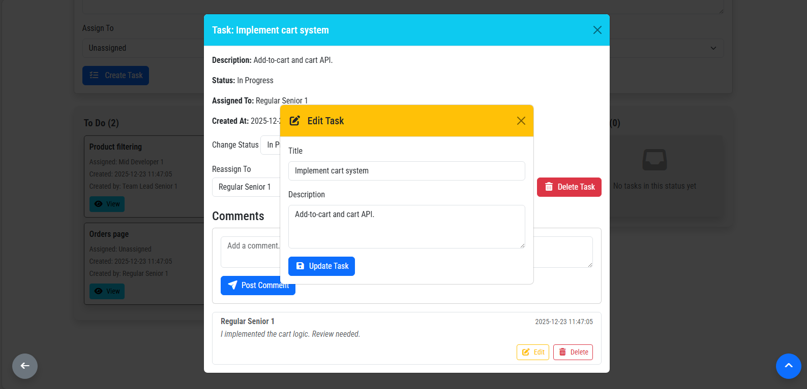
      <br><em>Edit task modal</em>
    </td>
    <td align="center" valign="top">
      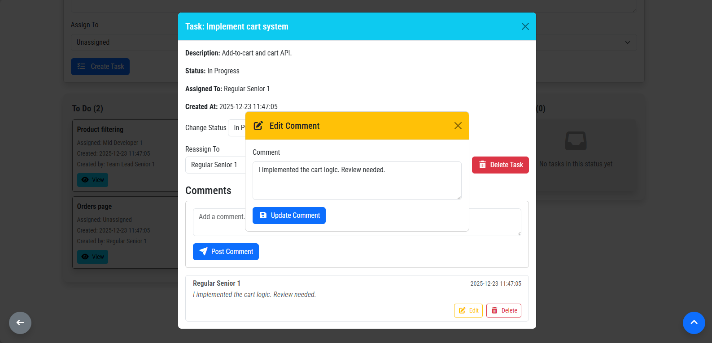
      <br><em>Edit comment modal</em>
    </td>
  </tr>
</table>

</details>

### Contributing

- This is a student project. For feedback or improvements, contact the author.

## 👥 Authors

- **Nikolovski Dejan** - [@Dejan.Nikolovski-FS21](https://git.brainster.co/Dejan.Nikolovski-FS21)
